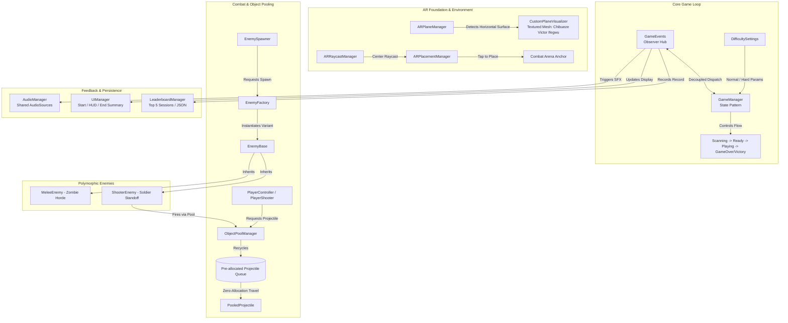

# Survival Shooter: Custom AR Plane Tracking Combat Experience
**Technical Architecture & Engineering Documentation**  
**Student Name:** Chibueze Victor Ifegwu  
**Course Module:** Mobile Augmented Reality Development  
**Target Platform:** Mobile AR (Android / ARCore, iOS / ARKit via AR Foundation)  
**Engine & Tools:** Unity 6 (6000.4.6f1), Universal Render Pipeline (URP 17.4.0), AR Foundation (6.4.2)  

---

## 1. System Architecture Overview

The **Survival Shooter AR** experience is designed around a decoupled, event-driven architecture that combines AR Foundation plane detection, a state machine-driven game loop, object-pooled physics projectiles, and an polymorphic enemy AI system.



---

## 2. Object-Oriented Programming (OOP) Structure

The codebase strictly adheres to the four fundamental OOP principles:

### A. Encapsulation
All mutable internal states across gameplay classes are guarded using private fields exposed solely through read-only C# properties. For example, in `EnemyBase`:
```csharp
[SerializeField] protected int maxHealth = 20;
protected int currentHealth;
public int CurrentHealth => currentHealth;
public int MaxHealth => maxHealth;
public bool IsDead => isDead;
```
This guarantees that external systems cannot maliciously or accidentally mutate health or state without invoking authorized domain methods such as `TakeDamage()`.

### B. Abstraction
Abstract classes and interfaces separate contracts from underlying implementation details:
- **`IDamageable`**: Unifies combat targets. Both `PlayerHealth` and `EnemyBase` implement `IDamageable`, allowing projectiles to interact with any target polymorphically without type inspection:
  ```csharp
  public interface IDamageable {
      int CurrentHealth { get; }
      bool IsDead { get; }
      void TakeDamage(int damageAmount, Vector3 hitPoint, Vector3 hitNormal);
  }
  ```
- **`IPooledObject`**: Declares mandatory lifecycle contracts (`OnObjectSpawn()`, `ReturnToPool()`) for recycled entities.
- **`EnemyBase`**: Declares abstract methods `MoveToPlayer()` and `AttackPlayer()`, enforcing that every enemy variant defines its own navigation and attack strategy.

### C. Inheritance
- `MeleeEnemy` and `ShooterEnemy` inherit common attributes, health tracking, collider registration, damage-flash coroutines, audio hooks, and score values directly from `EnemyBase`.
- Code duplication is reduced to zero for damage feedback, mesh color flashing, death animation sequencing, and despawning.

### D. Polymorphism
- **Dynamic Method Dispatch**: During combat updates, `EnemyBase.Update()` polymorphically calls `MoveToPlayer()` or `AttackPlayer()`, allowing the Horde Zombie to charge in for close-range bites while the Shooter Soldier halts at 4.0m standoff distance to lay down laser fire.
- **Damage Polymorphism**: When a `PooledProjectile` detects a trigger collision, it queries `other.GetComponentInParent<IDamageable>()` and invokes `TakeDamage()`, handling both player and enemy damage resolution transparently.

---

## 3. Design Patterns Applied

| Design Pattern | Implementation Class | Rationale & Architectural Benefit |
| :--- | :--- | :--- |
| **Object Pooling** | `ObjectPoolManager`, `PooledProjectile` | **Mandatory Requirement.** Eliminates runtime garbage collection (`GC.Collect`) spikes and micro-stutters during high-speed laser combat by recycling pre-warmed projectiles. |
| **Singleton** | `GameManager`, `AudioManager`, `ObjectPoolManager`, `EnemyFactory`, `EnemySpawner`, `ARPlacementManager`, `LeaderboardManager`, `UIManager` | Provides a unified, single source of truth for global service access without coupling components via fragile scene-wide searches or excessive parameter drilling. |
| **State Pattern** | `GameManager` (`GameState` machine) | Coordinates state transitions (`ScanningPlanes`, `PlacementReady`, `Playing`, `GameOver`, `Victory`), guaranteeing that UI panels, reticles, and enemy spawners only run in appropriate game phases. |
| **Factory Pattern** | `EnemyFactory` | Encapsulates the instantiation and difficulty parameterization of `MeleeZombie` vs. `ShooterSoldier` entities, decoupling wave spawner logic from prefab references. |
| **Observer Pattern** | `GameEvents` | Decouples gameplay logic from audio playback, camera shake, and UI rendering via static C# `Action` delegates (`OnPlayerHealthChanged`, `OnScoreChanged`, `OnTimeRemainingUpdated`). |

---

## 4. Object Pool Implementation Deep Dive

Runtime projectile instantiation is a known cause of memory fragmentation and garbage collection pauses in mobile AR applications running at 60fps.

1. **Pre-Allocation**: During `Awake()`, `ObjectPoolManager` pre-instantiates 30 Player Projectiles and 30 Enemy Projectiles, parents them under an internal container transform, and disables their GameObjects.
2. **Retrieval**: When `PlayerShooter` or `ShooterEnemy` fires, `SpawnFromPool()` dequeues an inactive projectile, translates it to the muzzle position, aligns its rotation, activates it, and invokes `IPooledObject.OnObjectSpawn()`.
3. **State Reset**: `PooledProjectile.OnObjectSpawn()` clears previous TrailRenderer points via `trailRenderer.Clear()`, re-enables collision triggers, resets velocity vectors, and initializes the lifetime counter.
4. **Recycling**: Upon impacting a target, obstacle, or exceeding maximum lifetime (3.5s for player, 4.0s for enemy), `ReturnToPool()` disables trail emission and collision triggers, deactivates the GameObject, and enqueues it back to the pool. **Zero runtime `Destroy()` or `Instantiate()` calls occur during active combat.**

---

## 5. Sound System Architecture & Audio Sources

Audio playback is centralized in `AudioManager` to avoid duplicate `AudioSource` components on every spawned enemy:

- **Channel Separation**: Four shared channels are maintained: Player SFX (2D), Enemy SFX (2D with pitch variation), UI Audio, and Ambient Audio.
- **Acoustic Fatigue Prevention**: `PlayWithPitchVariation()` dynamically modulates playback pitch between 0.85x and 1.15x for gunshots, enemy groans, and zombie bites.

### Gameplay Sound Mapping
1. **Player Shoot**: `Assets/Laser Weapons Sound Pack/Free/light_blast_1.wav`
2. **Player Death**: `Assets/ZombieHorrorPackageFree/WAV/BodyFall/Foley_BodyFall_001.wav`
3. **Enemy Spawn**: `Assets/ZombieHorrorPackageFree/WAV/VO/Zombie01/Zombie001_Idle_A_001.wav`
4. **Enemy Shoot (Shooter)**: `Assets/Laser Weapons Sound Pack/Free/heavy_blast_001.wav`
5. **Enemy Damage (Melee Attack)**: `Assets/ZombieHorrorPackageFree/WAV/Bite/Zombie_Attack_Bite_001.wav`
6. **Supplemental Polish**: `Button Pop.wav` (UI), `Zombie001_Hurt_A_001.wav` (Hit feedback), `Impact_Flesh_001.wav` (Kill sound).

---

## 6. Custom AR Plane Tracker

In accordance with assignment requirements:
- **Custom Textured Mesh**: The default Unity plane visualizer is replaced with `CustomPlaneTracker.prefab`.
- **Student Branding**: The texture `CustomPlane_ChibuezeVictorIfegwu.png` visibly and prominently displays the student's full name:  
  `[ AR COMBAT ZONE - CHIBUEZE VICTOR IFEGWU ]`  
  `PILOT: CHIBUEZE VICTOR IFEGWU | AR TRACKER ACTIVE`
- **Selective Rendering**: `CustomPlaneVisualizer` monitors `arPlane.trackingState` and `arPlane.alignment`, ensuring the visualizer renders only when horizontal tracking is active.
- **Single-Placement Lock**: Upon user tap, `ARPlacementManager` anchors the combat perimeter, flags `isObjectPlaced = true`, and sets `ARPlaneManager.requestedDetectionMode = PlaneDetectionMode.None` to freeze plane detection for peak frame stability.

---

## 7. Local Leaderboard & Session Persistence

The `LeaderboardManager` persists performance history across application launches:
- **Data Model**: `ScoreEntry` stores final score, enemies defeated, survival duration, difficulty mode, and formatted timestamps.
- **Storage Strategy**: Serialized into JSON format via `JsonUtility` and saved to `PlayerPrefs`.
- **Capped History**: Clamped strictly to the **latest 5 sessions**, formatted and presented in the UI modal with date and rank.

---

## 8. Difficulty Scaling System (Bonus Requirement)

Two distinct difficulty modes are configured in `DifficultySettings`:
- **Cadet (Normal)**: 90s survival timer, 3.2s spawn intervals, 1.0x enemy speed, standard health (Melee: 20 HP / 2 hits; Shooter: 50 HP / 5 hits).
- **Veteran (Hard)**: 120s survival timer, 2.0s spawn intervals, 1.35x enemy speed, 1.4x enemy health, 1.5x enemy damage.
